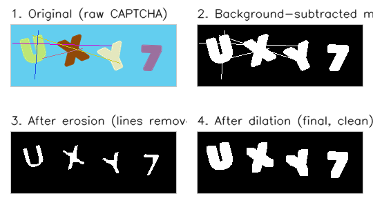
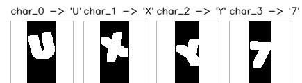

# De-Captcha

An end-to-end pipeline that segments and recognizes characters in rotation-obfuscated CAPTCHAs — colored, individually-tilted characters overlaid with random distractor lines.

**Result: 83% full-CAPTCHA accuracy (96.3% per-character accuracy) on the full 36-class alphabet (A-Z, 0-9, no exclusions), using an RBF-kernel SVM.**

For the story of how this was built — including what broke and how it got fixed — see [REPORT.md](./REPORT.md).

---

## Pipeline in Action

### Preprocessing: raw image to clean binary mask



### Segmentation: cutting the cleaned image into individual characters



---

## Problem Statement

Given a CAPTCHA image containing 4 colored, individually-rotated characters obscured by random obfuscation lines, recover the exact character sequence. The pipeline has no access to a bounding-box detector or pretrained OCR model — it must work from classical image processing and a from-scratch segmentation algorithm, followed by a lightweight, interpretable classifier.

**No public dataset of this exact CAPTCHA style was available**, so a synthetic data generator was built to reproduce the three properties that make this task non-trivial:
1. Character color differs from the background (enables color-based background subtraction)
2. Characters are individually rotated around their own pivot but never overlap (enables a simple geometric segmentation approach instead of a learned detector)
3. Thin random lines cross over the characters (forces the preprocessing to distinguish signal from noise, not just remove color)

## Pipeline

```
Raw CAPTCHA image
      |
      v
[1] Preprocessing
    - Estimate background color from image borders
    - Color-distance thresholding -> binary mask (foreground vs background)
    - Morphological erosion -> removes thin obfuscation lines
    - Morphological dilation -> restores character thickness
      |
      v
[2] Segmentation
    - Vertical column-sweep: find x-ranges with no foreground pixels
    - These gaps mark boundaries between individual characters
    - Crop each character out separately
      |
      v
[3] Classification
    - Resize each crop to 30x30, flatten to a 900-dim feature vector
    - RBF-kernel SVM (tuned via GridSearchCV) predicts the character
      |
      v
Predicted CAPTCHA string
```

## Results

### Character-level classification (36-class alphabet, full A-Z + 0-9, no exclusions)

An earlier version of this project excluded visually-ambiguous character pairs (`O`/`0`, `I`/`1`, `S`/`5`, `B`/`8`, `Z`/`2`) before training, which pushed per-character accuracy up to 99.25%. That number was real but measured on an easier 26-class problem. Re-running on the full, unrestricted 36-class alphabet gives a harder, more honest baseline:

| Model | Test Accuracy | Model Size |
|---|---|---|
| Logistic Regression | 74.97% | 254.2 KB |
| SVM (linear kernel) | 90.36% | 16,136.8 KB |
| **SVM (RBF kernel)** | **96.12%** | 16,867.7 KB |

Verified independently against a separate held-out test set: **96.38%** per-character accuracy — consistent with the training-time result, confirming the number is stable rather than a lucky split.

RBF SVM remains the clear best model, though the full-alphabet gap between models is much larger than it was on the reduced set (Logistic Regression drops over 20 points, from ~87% to 75%), showing linear decision boundaries struggle more as the number of visually-similar classes grows.

#### Where the errors actually come from

Confusion analysis on the RBF model's 29 test errors (out of 800 characters) showed something more interesting than "ambiguous characters are hard":

| True → Predicted | Count |
|---|---|
| `S → 8` | 6 |
| `6 → 0` | 4 |
| `8 → S` | 3 |
| `F → P` | 3 |
| all others | 1 each |

**Zero of the 29 errors exactly match the "classic ambiguous" pairs** (`O`/`0`, `I`/`1`, `S`/`5`, `B`/`8`, `Z`/`2`) the earlier version excluded. The real bottleneck turned out to be **digit-vs-digit confusion** — `S/8`, `6/0`, `8/5`, `9/0`, `6/8`, `9/8` together account for the large majority of errors — plus a repeatable `F/P` letter confusion. This shows the character-exclusion approach was solving the wrong problem entirely: it targeted a specific "famous" list of ambiguous pairs while the model's actual weak point is broader shape-similarity among digits under rotation, which that list didn't cover at all.

### Segmentation accuracy

**100/100 (100%)** of test images produced the correct number of character segments — this held on both the reduced and full 36-class alphabets, since segmentation depends only on geometry (non-overlapping rotated shapes), not character identity.

### End-to-end pipeline accuracy (the real-world metric)

Run on 100 raw, unseen CAPTCHA images, requiring every character to be predicted correctly:

**83/100 (83.0%) full-CAPTCHA accuracy.**

This is a meaningful drop from the reduced-alphabet result (95%), which is expected and correct — it's a harder, more general problem, and the drop is a direct, measurable consequence of no longer excluding hard characters, not a regression.

## Repository Structure

```
De-Captcha/
|-- data/
|   `-- generate_captchas.py     # Synthetic CAPTCHA dataset generator
|-- preprocessing/
|   |-- preprocess.py            # Grayscale, background subtraction, erosion/dilation
|   `-- tune_erosion.py          # Empirical erosion-iteration tuning experiment
|-- segmentation/
|   |-- segment.py                # Vertical-sweep character segmentation
|   `-- validate_segmentation.py  # Batch segmentation accuracy check
|-- classification/
|   `-- train_classifier.py       # Trains + compares LogReg / SVM-linear / SVM-RBF
|-- demo.py                       # End-to-end pipeline demo
`-- requirements.txt
```

## How to Run

```bash
# 1. Set up environment
python -m venv venv
venv\Scripts\activate          # Windows
pip install -r requirements.txt

# 2. Generate the synthetic dataset
python data/generate_captchas.py

# 3. (Optional) Inspect preprocessing/segmentation stage-by-stage
python preprocessing/preprocess.py
python preprocessing/tune_erosion.py
python segmentation/segment.py
python segmentation/validate_segmentation.py

# 4. Train the classifier
python classification/train_classifier.py

# 5. Run the end-to-end demo
python demo.py
```

## Design Notes & Deviations

A few deliberate choices worth calling out, made while adapting this pipeline to a from-scratch synthetic dataset:

- **Color-distance masking instead of grayscale-only subtraction.** Since character/background/line colors are randomly sampled per image, two different colors can map to the same grayscale value, losing discriminative information. Background subtraction is computed directly in BGR color space instead.
- **Font stroke thickness tuned empirically.** Initial character strokes were too thin to survive even a single erosion pass (measured via a pixel-count-per-iteration sweep) — fixed by increasing font size and adding a stroke outline at generation time, which shifted the effective working erosion range from ~6 iterations (as used in comparable reference reports) down to 2, since our obfuscation lines are thinner and die within a single erosion pass.
- **Stratified train/test split** across all 26 character classes, to guarantee every class is represented in both sets.
- **Full-CAPTCHA accuracy reported alongside per-character accuracy**, since per-character accuracy alone overstates real-world performance (a 4-character CAPTCHA needs all 4 predictions correct).

## Dataset

Full 36 character classes (`A-Z, 0-9`, no exclusions). 1000 synthetic CAPTCHAs generated (800 train / 200 test), each with 4 randomly rotated (+/-30 deg), randomly colored characters over a randomly colored background, obscured by 4-7 thin random-colored lines.

An earlier version excluded visually-ambiguous pairs (`O`/`0`, `I`/`1`, `S`/`5`, `B`/`8`, `Z`/`2`), reporting 99.25% accuracy. That exclusion was removed after error analysis showed it wasn't addressing the model's actual failure modes (see Results section above) — the full alphabet is used throughout this project now.
